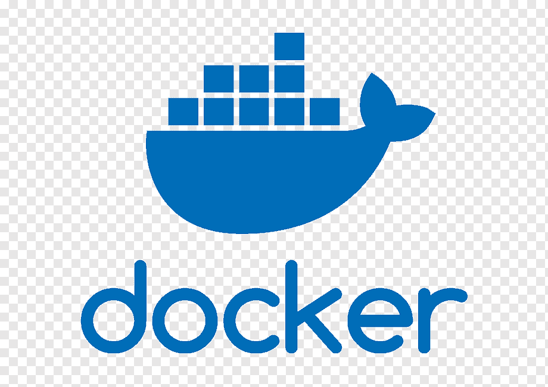
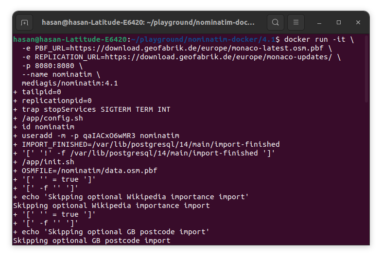

Geocoders are applications that enable us to search for any location on the planet and get its coordinates.
When we type the name of a restaurant into Google maps, Google's geocoder has to find the coordinates of that place and only then can the maps app take us there.

# How Geocoders work

At the heart of it all is a giant database keeping record of massive amount of geographical data. If you are curious look at this [video](https://www.youtube.com/watch?v=Q4zgDWY8ng0) by one of the mainainters of OpenStreetMap

# Hosting your own geocoder

Thanks to the generosity of the open-source community, we have OpenStreetMap data that is kept up-to-date with the real world by the power of volunteers.

We can use that data for many things, but for creating a geocoder server we are extra lucky since the same open-source community has given us several geocoder applications to choose from. The most popular choice is [Nominatim](https://github.com/osm-search/Nominatim) but other options include [Pelias](https://github.com/pelias/pelias) and [Photon](https://github.com/komoot/photon)

Most applications have docker containers available so you can get up and running without going through a detailed installation process.

## Caution

So far, everything I have told you sound very good. Almost too good to be true! Here is the catch: in order to deploy a geocoder that can cover the entire planet, you will need a machine with server specs 😱

As an example, here is what Nominatim wants in order to cover the planet:

> A minimum of 2GB of RAM is required or installation will fail. For a full planet import 128GB of RAM or more are strongly recommended. Do not report out of memory problems if you have less than 64GB RAM.

But we can still download a piece of the data, maybe for one country and play with it>

# Running Nominatim



Firstly, we will be using a docker image of the server so you must install docker on your machine.
Our second task is downloading a dataset that will not cause the server to swallow our RAM. luckily, the OSM data is devided by country and served on this [site](http://download.geofabrik.de/)

Here is what to do in order to start the server:

1. clone the Nominatim Github repo and `cd` into the latest version directory (for me it is v4.1):

```
git clone git@github.com:mediagis/nominatim-docker.git
cd nominatim-docker/4.1/
```

2. Inside, you will find a `readme` file with instructions on how to start the container. For version 4.1 it gives the following command:

```
docker run -it \
  -e PBF_URL=https://download.geofabrik.de/europe/monaco-latest.osm.pbf \
  -e REPLICATION_URL=https://download.geofabrik.de/europe/monaco-updates/ \
  -p 8080:8080 \
  --name nominatim \
  mediagis/nominatim:4.1
```

The above command uses `PBF_URL` argument to give the container a URL to the dataset. In this case it is the dataset of Monaco, a small country in Europe.



The container will load the data and start the server. At that point you can use the server by way of its [API](https://nominatim.org/release-docs/latest/api/Overview/)

Here is an example request:

```
http://localhost:8080/search?q=la+turbie
```

Here, we are using the `q=` argument which stands for query. we are searching for "la turbie" which is a place in Monaco.

To send this request to the server you can use a tool like Postman or simply open a browser tab and visit the above link.


