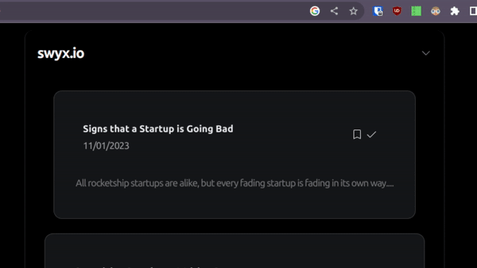

# display temporary mesage using hooks

here is how to display a temporary error message or a warning in a React app using hooks and `setTimeout`


## The desired result

Take a look:



## What we need

We need a state that goes from `false` to `true` and then back to `false` after some time.

## How it works

Here is a simple solution: we create a state and initialize it to `false`, we create a `toggle` function that sets state to `true` and then inside the same function we call `setTimeout` and have it reset the state to `false` after some time.

We will store the above logic inside a hook so we can reuse it.

### important detail

We can’t just call `setTimeout` and forget about it, we must remove it when the component dismounts. Otherwise we will have multiple instances of it.

To remove `setTimeout` we must store a reference to it. We do that via the `useRef` hook. We then use `clearTimeout` to clear `setTimeout` when the component dismounts (the return of `useEffect`)

## The code

Here is the hook, I called it `useError.js`

```rust
import { useEffect, useRef, useState } from "react";

export default function useError() {
  const [isVisible, setisVisible] = useState(false);
  const timerRef = useRef(null);

  function toggleVisibility() {
    setisVisible(true);
    timerRef.current = setTimeout(() => setisVisible(false), 1000);
  }

  useEffect(() => {
    // Clear the interval when the component unmounts
    return () => clearTimeout(timerRef.current);
  }, []);

  return [isVisible, toggleVisibility];
}
```

Here is where I use the above hook to display a message:

```rust
import { Grid } from "@nextui-org/react";
import Bookmark from "./icons/bookmark";
import Checkmark from "./icons/checkmark";
import styles from "./cardButtons.module.css";
import ErrorCard from "./errorCard";
import { useState } from "react";
import useError from "@/hooks/useError";

export default function CardButtons({ articleID }) {
  const [isVisible, toggleVisibility] = useError();

  async function bookmarkArticle(e, articleID) {
    e.stopPropagation();
    console.log("bookmarking", articleID);
    var requestOptions = {
      method: "POST",
      redirect: "follow",
      cerendtials: "include",
    };
    try {
      const response = await fetch(
        `http://localhost:3000/api/articles?articleid=${articleID}`,
        requestOptions
      );

      if (!response.ok) {
        const result = await response.text();
        throw new Error(result);
      }
    } catch (error) {
      console.log("oops!", error);
      toggleVisibility();
    }
  }
  return (
    <>
      <Grid xs={12} justify="flex-end">
        <Bookmark handler={(e) => bookmarkArticle(e, articleID)} />
        <Checkmark />
        {isVisible && (
          <p style={{ position: "fixed", top: "5px", right: "5px" }}>
            Already bookmarked
          </p>
        )}
      </Grid>
    </>
  );
}
```

The above code is taken from a side project of mine so excuse the clutter.

### Further reading

https://felixgerschau.com/react-hooks-settimeout/
